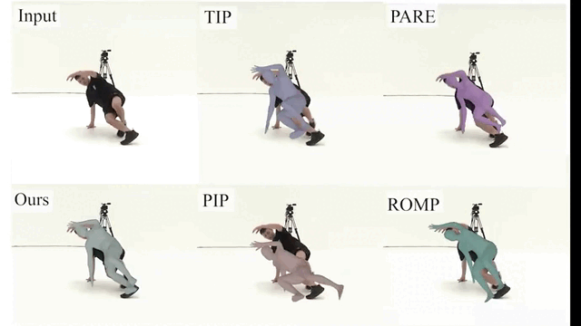

# RobustCap

[comment]: <> (Code for our SIGGRAPH ASIA 2023 [paper]&#40;&#41; "Fusing Monocular Images and Sparse IMU Signals for Real-time Human)

[comment]: <> (Motion Capture". This repository contains the system implementation and evaluation. See [Project Page]&#40;&#41;.)
<div align="left">
  

<br>
</div>

## Installation
```
conda create -n RobustCap python=3.8
conda activate RobustCap
pip install -r requirements.txt
```
## Data
### SMPL Files, Pretrained Model and Test Data
- Download smpl files from [here](https://drive.google.com/file/d/1lsHC3mupzGqrzHEkXlXwKWXtw5d8Fxr3/view?usp=drive_link) or the official [website](https://smpl.is.tue.mpg.de/). Unzip it and place it at `models/`. 
- Download the [pretrained model and data](https://drive.google.com/file/d/1oDnFd8h4mTCSYKD4zEA0AL3b6qUeUtvl/view?usp=drive_link) and place them at `data/`.
## Evaluation
We provide the evaluation code for AIST++, TotalCapture, 3DPW and 3DPW-OCC. The results maybe slightly different from the numbers reported in the paper due to the randomness of the optimization.
```
python evaluate.py
```
## Todo
- Visualization.
- Live demo code.
## Citation  
```
TBA
```
